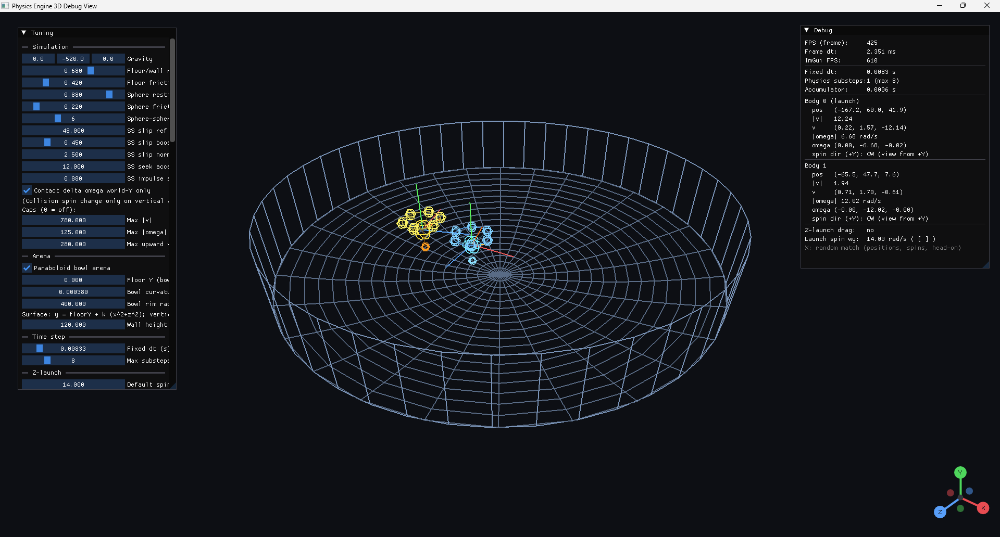

# Physics Engine (3D prototype)

A **Windows / C++ / OpenGL** playground for a **fixed-timestep rigid-body simulation** with compound sphere colliders (Beyblade-style tops), an optional **paraboloid bowl arena**, **Dear ImGui** tuning panels, and a **GLFW** window with wireframe debug drawing.

This is an **experimental research / game-feel** project, not a general-purpose physics engine library.

## Screenshot



## Features (high level)

- Two rigid bodies with configurable **mass**, **inertia**, and **sphere-soup** collision geometry (tip, hub, disk ring, optional mid-attack spheres).
- **Gravity**, **air drag**, **angular damping** (including tumble vs spin-axis), **gyro upright assist**, and an optional **battle band** (XZ pull between tops when grounded).
- **Arena**: flat floor + axis-aligned walls, or **analytic paraboloid bowl** with a cylindrical rim (`SimulationTuning` in `Physics_Engine/src/physics/tuning.hpp`).
- **Z-drag slingshot** launch for one “launchable” top; **X** random match reset.
- **ImGui** HUD (FPS, body state) and a large **Tuning** window; layout persists via `imgui.ini` next to the executable when run from the project directory.

## Requirements

- **Windows 10+** (project targets Windows).
- **Visual Studio** with the **Desktop development with C++** workload. The `.vcxproj` sets **PlatformToolset v145**; change it in the project properties if your MSVC toolset version differs.
- **C++20** (`stdcpp20`).
- **OpenGL 4.0** core context (see `main.cpp`).

## External dependencies (GLFW + GLAD)

The Visual Studio project expects **GLFW** and **GLAD** in a sibling folder layout like this (paths are wired in `Physics_Engine/Physics_Engine.vcxproj` for **Debug | x64** only today—if **Release | x64** fails to find headers or `glfw3.lib`, duplicate the same `IncludePath` / `LibraryPath` entries for that configuration):


| Role                                       | Path (example on disk)                                                                                  |
| ------------------------------------------ | ------------------------------------------------------------------------------------------------------- |
| Headers (`glad/glad.h`, `GLFW/glfw3.h`, …) | `D:\Projects\OpenGL\include`                                                                            |
| Import library (`glfw3.lib`)               | `D:\Projects\OpenGL\lib`                                                                                |
| GLAD source                                | `D:\Projects\OpenGL\lib\glad.c` (referenced as `..\..\OpenGL\lib\glad.c` from the `.vcxproj` directory) |


**If your OpenGL kit lives elsewhere**, update in `Physics_Engine.vcxproj`:

- `PropertyGroup` → `IncludePath` / `LibraryPath` for **Debug | x64** (and add matching entries for **Release | x64** / Win32 if you use those).
- The `ClCompile` path to `glad.c`.

**Bundled in-repo:** [Dear ImGui](https://github.com/ocornut/imgui) under `Physics_Engine/third_party/imgui/` (no separate install step).

## How to build and run

1. Install **GLFW** and generate/use **GLAD** for OpenGL 4.0 core, and align paths with `Physics_Engine.vcxproj` as described above.
2. Open **`Physics_Engine/Physics_Engine.vcxproj`** in Visual Studio.
3. Select configuration **Debug** (or **Release**) and platform **x64** (recommended; x64 has explicit GLFW link settings in the project).
4. **Build → Build Solution** (or F7), then **Debug → Start Without Debugging** if you prefer not to break on main.

The built executable is placed under the project’s output directory (e.g. `Physics_Engine/x64/Debug/`). Run it from a working directory where you are happy for **`imgui.ini`** to be written, if you want ImGui window positions/sizes to persist.

## Controls (default)


| Input         | Action                                                                                                           |
| ------------- | ---------------------------------------------------------------------------------------------------------------- |
| **Mouse**     | Orbit camera (when ImGui is not capturing the mouse).                                                            |
| **X**         | Random match: respawn both tops with random spins and closing speed.                                             |
| **Z** (hold)  | Slingshot mode for the launchable top: drag on the arena floor to aim release sets horizontal velocity and spin. |
| **`[` / `]`** | Adjust pending launch spin while **Z** is held (see HUD).                                                        |


Exact behavior is easier to tune from the **Tuning** ImGui window (`SimulationTuning`).

## Repository layout

```
Physics_Engine/
  Physics_Engine.vcxproj   # Visual Studio project
  main.cpp                 # GLFW loop, rendering, input
  src/
    app/                   # Camera, ImGui overlay, helpers
    math/                  # Vectors, matrices, small math utils
    physics/               # Integration, contacts, tuning
    render/                # Debug line drawing (OpenGL)
  third_party/
    imgui/                 # Dear ImGui + GLFW/OpenGL3 backends
```

## Configuration

- **Runtime simulation parameters** live in `Physics_Engine/src/physics/tuning.hpp` (`SimulationTuning` / `g_simTuning`) and are edited at runtime through **ImGui** in `src/app/debug_overlay.cpp`.
- **Initial rigid-body layout** and globals are set in `src/physics/physics.cpp` (e.g. `g_rigidBodies`); call `syncRigidBodiesFromTuning()` after changing shape-related tuning from the UI (the **Reset all to defaults** button does this).

## License / third party

See vendor licenses inside `Physics_Engine/third_party/imgui/` for ImGui. GLFW and GLAD follow their respective licenses once you add them to your machine layout.